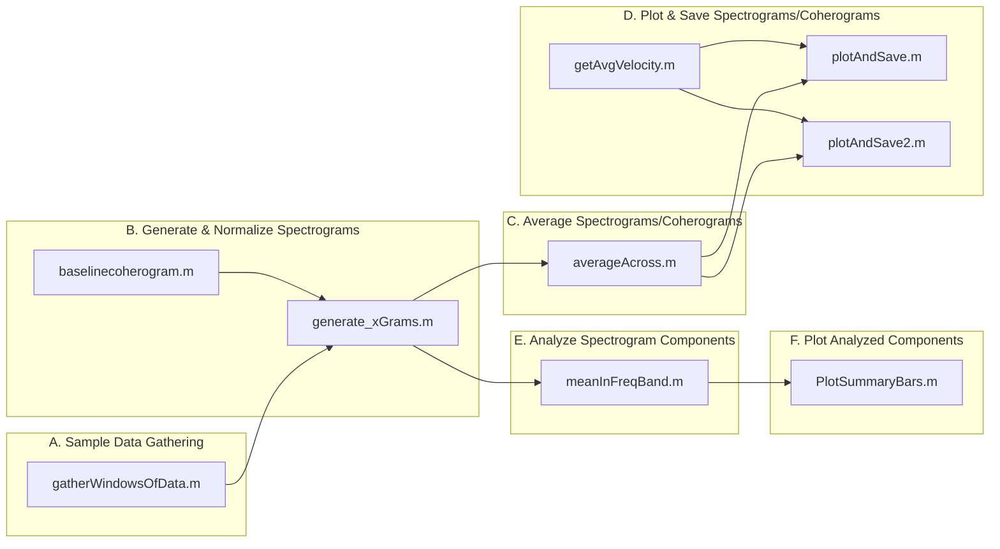

# ThetaCoherence
## Analyzing Theta Oscillations in the Hippocampus and Prefrontal Cortex

This MATLAB repository contains code for analyzing theta oscillations and their coherence between the hippocampus (CA1, iCA1) and prefrontal cortex (PFC) in electrophysiology data. The analysis focuses on specific behavioral events and trajectories within a W-maze task.

### Key Features:

```markdown
Event-Triggered Analysis: Extracts and analyzes neural data time-locked to specific behavioral events (e.g., segment transitions on a maze).

Spectrogram and Coherogram Generation: Computes spectrograms for individual tetrodes and coherograms for tetrode pairs.

Trial Averaging: Averages spectrograms and coherograms across trials for robust measures of oscillatory activity.

Frequency Band Analysis: Calculates the mean power within a specific frequency band (e.g., theta band) and identifies the strongest frequency per time bin.

Data Visualization: Generates plots of spectrograms, coherograms, animal position, and average velocity for visualization and interpretation.
```

### Pipeline Structure

The analysis pipeline is organized into the following main sections:



#### A. Sample Data Gathering:

`gatherWindowsOfData.m`: Extracts epochs of EEG data aligned to specific behavioral events, such as segment transitions.

#### B. Generate and Normalize Spectrograms:

`baselinecoherogram.m`: Computes baseline spectrograms for normalization.
generate_xGrams.m: Generates spectrograms and coherograms from the acquired data windows.
#### C. Average Spectrograms/Coherograms:

`averageAcross.m`: Averages spectrograms and coherograms across trials.
#### D. Plot and Save Spectrograms/Coherograms:

`getAvgVelocity.m`: Calculates average velocity during sampled epochs.

`plotAndSave.m`, `plotAndSave2.m`: Generates plots of spectrograms, coherograms, animal position, and average velocity.

#### E. Analyze Spectrogram Components:

`meanInFreqBand.m`: Computes the mean power within a specified frequency band and estimates the strongest frequency.

#### F. Plot Analyzed Components:

`PlotSummaryBars.m`: Plots bar graphs summarizing frequency band power across days or epochs.

### Getting Started

#### Organize Data 

Ensure your electrophysiology and behavioral data are organized in a consistent folder structure. See `AnalysisMain.m` for expected data file naming conventions.

#### Configure Parameters: Modify the AnalysisMain.m script to specify:
Animal IDs (e.g., 'HPa', 'HPb').
Days and epochs to analyze.
Tetrodes of interest (including pairs for coherence).
Sampling parameters (e.g., segment transitions, radii around points).
Frequency band for analysis.
Output options (saving to file, plotting).
#### Run Analysis: 
Run the AnalysisMain.m script to execute the analysis pipeline.

### Code Overview
Key Scripts:

- `AnalysisMain.m`: Main script that controls the entire analysis pipeline.
- `gatherWindowsOfData.m`: Acquires epochs of data based on behavioral events.
- `generate_xGrams.m`: Generates spectrograms and coherograms.
- `averageAcross.m`: Averages spectrograms and coherograms across trials.
- `plotAndSave.m`: Plots and saves various visualizations.
- `meanInFreqBand.m`: Analyzes frequency band power.

Helper Scripts:

- `EnforceException.m`: Allows for specific exceptions in processing parameters.
- `getAllSubs.m`: Retrieves subscripts for data structures.

Developing Plot Functions: 

Contains scripts for specialized plotting.

